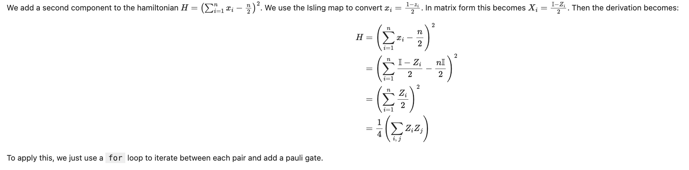
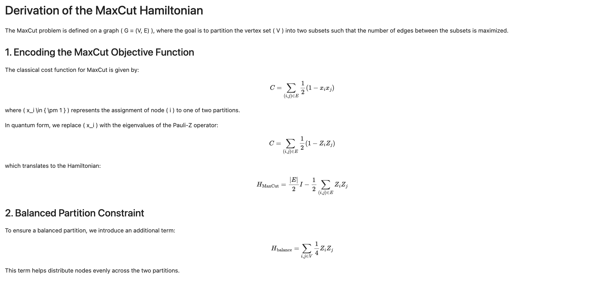
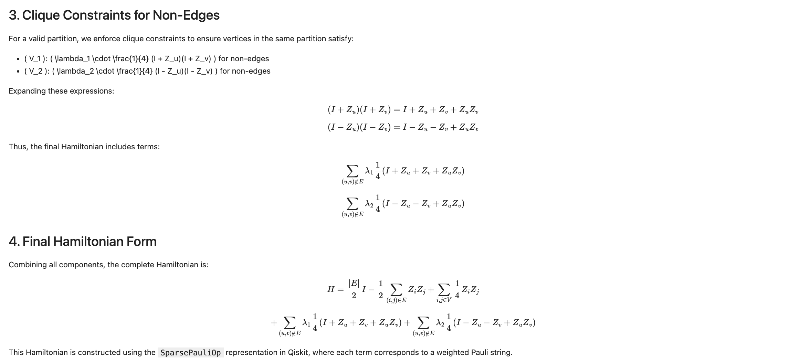

# Team IsamBits solutions to IonQ's challenge at iQuHack

- [Max-cut using varQITE](1-IonQuHack2025.ipynb)
- [Constraint that both partitions must have equal cardinality](2-IonQuHack2025.ipynb)
- [Constraint that both paritiions must be connected](3-IonQuHack2025.ipynb)

See the:
- build_ansatz()
- build_maxcut_hamiltonian()

for the majority of changes and below for the QP (or MIQP) to hamiltonian derivations:

